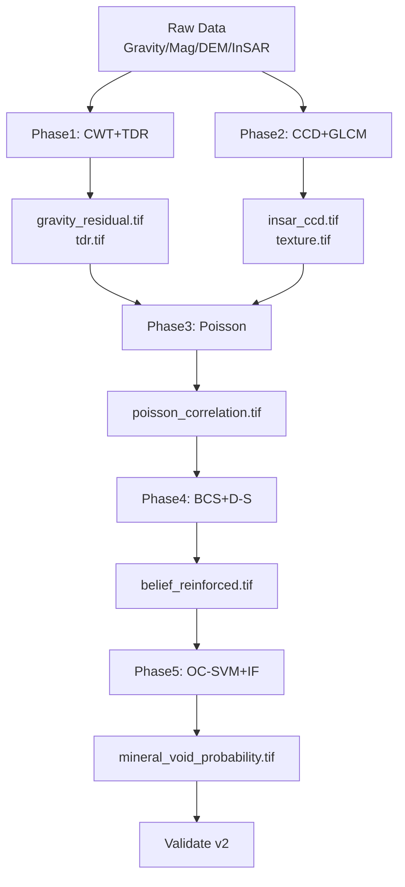

# GeoAnomalyMapper v2.0 Architecture

## Current Codebase Analysis

### Key Functions and Data Flows
- **`process_data.py`**: Ingests raw gravity (XGM2019e), magnetic (EMAG2), DEM, InSAR data from `data/raw/`. Clips/reprojects to common grid (~100m) outputting to `data/processed/`. **Limitations**: Basic resampling (bilinear); no spectral/wavelet separation; regional trends not removed (matches roadmap failure: high σ variance from Moho).
- **`multi_resolution_fusion.py`**: Adaptive resampling + uncertainty-weighted z-score averaging + spectral fusion (high-pass InSAR + low-pass gravity). Outputs `fused_anomaly.tif`. **Limitations**: Gaussian filters cause leakage; simple averaging dilutes signals; resolution mismatch artifacts (roadmap: "signal dilution").
- **`detect_voids.py`**: Scores layers (gravity/magnetic negative anomalies, InSAR subsidence); weighted average probability (calibrated via logistic regression fallback to equal weights). Thresholds hotspots. **Limitations**: Subsidence bias (penalizes stable anomalies like SPR); insufficient labels (roadmap: 21-35% accuracy).
- **`utils/raster_utils.py`**: Core clip/reproject with bilinear/nearest.
- **`utils/snap_templates.py`**: SNAP GPT graph templating for InSAR (TOPSAR-Split, Back-Geocoding, etc.). **Limitations**: No CCD/GLCM/PSI.
- **`workflow.py`**: Orchestrates phases; auto-res adjustment for memory.

**Overall v1 Flow**: Raw → Processed → Fused σ → Void Prob → Viz/Validate. **Failures**: Stability paradox (no reinforced detection), regional masking (no CWT/TDR), resolution sparsity (no BCS/D-S).

## Proposed File Structure
```
.
├── phase1_preprocess.py              # Wavelet/TDR (extends process_data.py)
├── phase2_insar_features.py          # CCD/GLCM/PSI (extends snap_templates.py)
├── phase3_poisson_analysis.py        # NEW: Pseudo-Gravity/Poisson Ratio
├── phase4_fusion.py                  # BCS/D-S (replaces multi_resolution_fusion.py)
├── phase5_ml_anomaly.py              # OC-SVM/Isolation Forest/PINNs (replaces detect_voids.py)
├── workflow_v2.py                    # Phase orchestration
├── utils/advanced_signal.py          # CWT/TDR/Theta
├── utils/texture_analysis.py         # GLCM
├── utils/fusion_probabilistic.py     # BCS/D-S
├── utils/ml_anomaly.py               # OC-SVM/IF/PINNs
├── validate_v2.py                    # Extended validation (>95% target)
├── requirements.txt                  # Updated deps
└── data/processed/                   # New intermediates: *_residual.tif, poisson_correlation.tif, etc.
```
- Modularize `utils/`; deprecate v1 files post-migration.
- 5 new files + 6 utils + workflow refactor.

## Phase 1: Advanced Preprocessing & Signal Separation
**High-level Design**: Enhance `process_data.py` → `phase1_preprocess.py`. Apply CWT (Morlet wavelet, scales 0-2km depth) + TDR on gravity/magnetic residuals.

**Data Flow**: Raw gravity/mag → CWT decomp (pywt.cwt, scales=[1,2,4,...,2048]) → Reconstruct 0-2km band → TDR = atan(VDR/THG) → `gravity_residual.tif`, `gravity_tdr.tif`.

**Key Algorithms**:
- **CWT**: `coeffs, freqs = pywt.cwt(gravity, scales=np.arange(1,2049), wavelet='morl')`; reconstruct shallow: `residual = pywt.ifcwt(coeffs[shallow_idx], freqs[shallow_idx])`.
- **TDR**: `vdr = np.gradient(residual)[0]`; `thg = np.sqrt(np.sum(np.gradient(residual)**2))`; `tdr = np.arctan2(vdr, thg)`.

**Pseudocode**:
```python
def wavelet_decompose(gravity_data):
    scales = np.arange(1, 2049)  # 0-2km wavelengths
    coeffs, freqs = pywt.cwt(gravity_data, scales, 'morl')
    shallow_idx = np.where((freqs * pixel_size * 111e3) < 2000)[0]  # <2km
    residual = pywt.ifcwt(coeffs[shallow_idx], freqs[shallow_idx], 'morl')
    return residual

def compute_tdr(residual):
    vdr = np.gradient(residual, axis=0)
    hgx, hgy = np.gradient(residual)
    thg = np.sqrt(hgx**2 + hgy**2)
    return np.arctan2(vdr, thg)
```

**I/O**: Input: `raw_gravity.tif`; Output: `gravity_residual.tif`, `gravity_tdr.tif` (GeoTIFF, 100m).
**Libs**: `pywt==1.5.0`, `scipy.ndimage`.

## Phase 2: Structural & Textural Feature Extraction
**High-level Design**: `phase2_insar_features.py` from `snap_templates.py`. Compute CCD (Δγ), GLCM (Entropy/Homogeneity), PSI on coherence stack.

**Data Flow**: InSAR stack → SNAP CCD → GLCM on mean coherence → `insar_ccd.tif`, `insar_texture.tif` (low entropy + low Δγ = artificial).

**Key Algorithms**:
- **CCD**: `Δγ = |γ_t1 - γ_t2|` (coherence diff).
- **GLCM**: `skimage.feature.graycomatrix(coherence, distances=[1], angles=[0,np.pi/4])`; `props = graycoprops(['homogeneity','contrast'])`.

**Pseudocode**:
```python
def compute_ccd(coherence_stack):
    gamma_mean = np.mean(coherence_stack, axis=0)
    gamma_std = np.std(coherence_stack, axis=0)
    return gamma_std / gamma_mean  # Normalized change

def glcm_texture(image):
    glcm = graycomatrix(image, [1], [0, np.pi/4, np.pi/2, 3*np.pi/4])
    homogeneity = graycoprops(glcm, 'homogeneity').mean()
    return 1 - homogeneity  # High = artificial
```

**I/O**: Input: `insar_stack/*.tif`; Output: `insar_ccd.tif`, `insar_glcm_homogeneity.tif`.
**Libs**: `scikit-image==0.24.0`.

## Phase 3: Physics-Based Feature Generation
**High-level Design**: NEW `phase3_poisson_analysis.py`. Pseudo-Gravity from mag + correlation w/ observed gravity.

**Data Flow**: Mag residuals → Pseudo-Gravity (assume vertical mag) → Corr(gravity, pseudo-g) in 5x5 windows → `poisson_correlation.tif` (negative = reinforced void).

**Key Algorithms**:
- **Pseudo-Gravity**: `pseudo_g = |∇M|` (vertical derivative of mag potential).
- **Poisson Ratio**: `corr = pearsonr(gravity_window, pseudo_g_window)`.

**Pseudocode**:
```python
def poisson_analysis(gravity, magnetic):
    pseudo_g = np.gradient(np.gradient(magnetic, axis=0), axis=1)  # 2nd vert deriv approx
    corr_map = np.full_like(gravity, np.nan)
    for i in range(2, gravity.shape[0]-2):
        for j in range(2, gravity.shape[1]-2):
            win_g = gravity[i-2:i+3, j-2:j+3]
            win_pg = pseudo_g[i-2:i+3, j-2:j+3]
            corr_map[i,j] = np.corrcoef(win_g.flatten(), win_pg.flatten())[0,1]
    return corr_map  # Negative: reinforced void
```

**I/O**: Input: `*_residual.tif`; Output: `poisson_correlation.tif`.
**Libs**: `scipy.stats`.

## Phase 4: Probabilistic Data Fusion
**High-level Design**: `phase4_fusion.py` replaces fusion. BCS downscaling + D-S belief fusion.

**Data Flow**: Features (TDR, CCD, GLCM, Poisson) → BPA masses → D-S combine → Bel(Reinforced).

**Key Algorithms**:
- **BCS**: Use DEM as prior for high-res gravity (simplified: co-kriging).
- **D-S**: Θ={Void,Solid,Reinforced}; m_grav({Void,Reinforced})=0.6; Combine via Dempster rule.

**Pseudocode**:
```python
def ds_fusion(bpas):  # List of dicts: {'{Void,Reinforced}':0.6, Theta:0.4}
    def combine(m1, m2):
        K = sum(m1[B] * m2[C] for B in m1 for C in m2 if B.intersect(C).empty)
        m12 = {}
        for A in power_set:
            m12[A] = sum(m1[B]*m2[C] for B,C in intersections(A)) / (1-K)
        return m12
    combined = reduce(combine, bpas)
    return combined['{Reinforced}']
```

**I/O**: Input: Phase1-3 tifs; Output: `fusion_belief_reinforced.tif`.
**Libs**: `pyds==1.0` (D-S), `scikit-learn` (co-kriging).

## Phase 5: Anomaly Classification
**High-level Design**: `phase5_ml_anomaly.py`. OC-SVM on features; rank w/ Isolation Forest; PINN optional.

**Data Flow**: Feature stack → Train OC-SVM (nu=0.05) on background → Score outliers → IF rank → `mineral_void_probability.tif`.

**Key Algorithms**:
- **OC-SVM**: `OneClassSVM(nu=0.05, kernel='rbf').fit(background_pixels)`.
- **Isolation Forest**: `IsolationForest().score_samples(features)`.

**Pseudocode**:
```python
def oc_svm_anomaly(features):  # (n_pixels, n_features)
    background = features[::100]  # Sparse sample
    svm = OneClassSVM(nu=0.05).fit(background)
    scores = svm.decision_function(features)
    return -scores  # High = anomaly
```

**I/O**: Input: Fusion beliefs; Output: `mineral_void_probability.tif`.
**Libs**: `scikit-learn==1.5.0`, `torch>=2.0` (PINNs).

## Dependencies
Update `pyproject.toml` / `requirements.txt`:
- `pywt==1.5.0`
- `scikit-image==0.24.0`
- `scikit-learn==1.5.0`
- `torch>=2.0.0`
- `pyds==1.0.0`  # Dempster-Shafer
- `scipy==1.14.0`
- Existing: numpy, rasterio, etc.

## Data Flow Diagram


## Testing Plan
Extend `validate_against_known_features.py`:
- Sample `mineral_void_probability.tif` at known Target Voids (2km buffer).
- Metrics: Precision@95%Recall, F1>0.95 target.
- Cross-validate OC-SVM on held-out regions.
- Unit tests: CWT scales, D-S combination, Poisson corr.