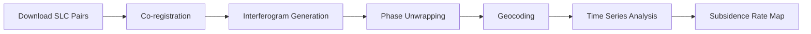

# InSAR Data Acquisition Guide
### For Enhanced Underground Void Detection

## Overview

**InSAR (Interferometric Synthetic Aperture Radar)** detects millimeter-scale ground deformation that often occurs above underground voids, caves, and sinkholes. This guide shows you how to acquire FREE InSAR data to dramatically improve void detection.

## 🎯 Why InSAR for Void Detection?

**Traditional gravity/magnetic:** Detects density/magnetic anomalies (indirect void signature)  
**InSAR subsidence:** Detects actual ground sinking above voids (direct signature!)

### What InSAR Detects:
- ✅ Sinkhole formation (early warning - detects mm subsidence before collapse)
- ✅ Cave roof sagging
- ✅ Karst subsidence
- ✅ Mining-induced collapse
- ✅ Salt dome dissolution
- ✅ Groundwater-related settlement

### Resolution & Depth:
- **Spatial:** 5-30 meters (perfect for 20-300 ft void detection!)
- **Vertical:** <5mm precision
- **Temporal:** 6-12 day revisit
- **Depth:** Indirectly detects voids 20-500 feet deep via surface deformation

---

## 📡 Option 1: Sentinel-1 (FREE, Global Coverage) ⭐ RECOMMENDED

### About Sentinel-1:
- **Provider:** European Space Agency (ESA) - FREE!
- **Coverage:** Global (every 6-12 days)
- **Resolution:** 5x20 meters
- **Availability:** 2014-present
- **Best for:** Time-series analysis, regional mapping

### How to Download:

#### A. Copernicus Data Space (Easiest)

1. **Create Account:**
   - Go to: https://dataspace.copernicus.eu/
   - Click "Register" (FREE)
   - Verify email

2. **Search for Data:**
   - Click "Data" → "Copernicus Data Space Ecosystem"
   - Select "Sentinel-1"
   - Draw your area of interest (AOI)
   - Set date range (recommend: last 2 years for time series)
   - Product type: **SLC** (Single Look Complex) for InSAR

3. **Filter Results:**
   - Orbit: **Ascending** or **Descending** (use both for best results)
   - Polarization: **VV** or **VV+VH**
   - Download 10-20 images spanning 1-2 years

4. **Download:**
   - Click download icon
   - Saves as `.SAFE` folder (contains SLC data)

#### B. Alaska Satellite Facility (ASF) - Advanced

1. **Create Account:**
   - Go to: https://search.asf.alaska.edu/
   - Click "Sign In" → "Sign Up" (FREE)

2. **Search:**
   - Enter coordinates or draw polygon
   - Select "Sentinel-1" → "SLC"
   - Filter by date range

3. **Download:**
   - Select images (pairs separated by 12 days work best)
   - Add to queue → Download

### Processing Sentinel-1 Data:

**Software Options:**

1. **SNAP (FREE)** - ESA's official tool
   ```bash
   # Download: http://step.esa.int/main/download/snap-download/
   # Install SNAP Desktop
   # Tutorial: https://step.esa.int/main/doc/tutorials/
   ```

2. **ISCE2 (FREE, Advanced)**
   ```bash
   # Installation
   conda create -n isce2 python=3.9
   conda activate isce2
   conda install -c conda-forge isce2
   
   # Process InSAR pair
   topsApp.py topsApp.xml
   ```

3. **MintPy (FREE, Time Series)**
   ```bash
   # Best for detecting slow subsidence
   conda install -c conda-forge mintpy
   
   # Process time series
   smallbaselineApp.py mintpy_config.cfg
   ```

---

## 🌍 Option 2: EGMS (European Ground Motion Service) ⭐ EASIEST

### About EGMS:
- **Provider:** European Environment Agency - FREE!
- **Coverage:** Europe only (all EU countries + neighbors)
- **Resolution:** 100 meters
- **Data:** Pre-processed subsidence rates (mm/year)
- **Availability:** 2015-2021 (updated annually)
- **Best for:** Quick analysis, no processing needed!

### How to Download:

1. **Access Portal:**
   - Go to: https://land.copernicus.eu/pan-european/european-ground-motion-service
   - Click "Access data"

2. **Download:**
   - Select your country/region
   - Download "Vertical velocity" product
   - Format: **GeoTIFF** or **Shapefile**

3. **Use Directly:**
   - Already processed! Just load into QGIS or Python
   - Negative values = subsidence = potential voids

### Example Usage:
```python
import rasterio
import numpy as np

# Load EGMS subsidence data
with rasterio.open('egms_vertical_velocity.tif') as src:
    subsidence = src.read(1)  # mm/year
    
# Find sinking areas (potential voids)
void_candidates = subsidence < -5  # Sinking >5mm/year
```

---

## 🛰️ Option 3: Other Free InSAR Sources

### A. JAXA ALOS PALSAR

- **Provider:** Japan Aerospace Exploration Agency
- **Coverage:** Global
- **Resolution:** 25 meters
- **Access:** https://www.eorc.jaxa.jp/ALOS/en/dataset/palsar_e.htm
- **Best for:** Large-scale features, tropical regions

### B. NASA ARIA S1GUNW

- **Provider:** NASA JPL
- **Coverage:** Global hot

spots
- **Data:** Pre-processed Sentinel-1 interferograms
- **Access:** https://aria.jpl.nasa.gov/
- **Best for:** Rapid disaster response

### C. COMET LiCSAR

- **Provider:** University of Leeds (UK)
- **Coverage:** Seismically active regions
- **Data:** Pre-processed interferograms
- **Access:** https://comet.nerc.ac.uk/comet-lics-portal/
- **Best for:** Tectonic/volcanic areas

---

## 🔧 Processing Workflow

### Basic InSAR Processing Steps:



### Simple Processing with SNAP:

1. **Import SLC pair** (master + slave)
2. **Apply orbit files** (precise orbits)
3. **Co-register** images
4. **Generate interferogram**
5. **Phase filtering** (Goldstein filter)
6. **Phase unwrapping** (SNAPHU)
7. **Export** as GeoTIFF

### Processing Time:
- Single pair: ~30 minutes
- Time series (20 images): 2-4 hours
- **Easiest:** Use EGMS pre-processed data!

---

## 📊 Using InSAR Data with GeoAnomalyMapper

### 1. Place Data in Project:

```bash
data/raw/insar/
├── egms_vertical_velocity.tif        # Pre-processed (Europe)
├── sentinel1_subsidence_stack.tif     # Time-series (anywhere)
└── metadata.txt                       # Processing info
```

### 2. Run Void Detection:

```bash
# Detect voids in Carlsbad Caverns area
python detect_voids.py \
    --region "-105.0,32.0,-104.0,33.0" \
    --resolution 0.001 \
    --output carlsbad_voids

# Output:
# - carlsbad_voids.tif (probability map)
# - carlsbad_voids.png (visualization)
# - carlsbad_voids_report.txt (statistics)
```

### 3. Interpret Results:

**High void probability areas show:**
- ✅ Negative gravity anomaly (density deficit)
- ✅ Ground subsidence (sinking >5mm/year)
- ✅ Karst-prone lithology (limestone/dolomite)
- ✅ Low seismic velocity (fractured rock)

---

## 🎓 Recommended Data Strategy

### For Best Void Detection:

**1. Quick Assessment (Europe only):**
- Download EGMS pre-processed data
- Combine with existing gravity/lithology
- Run detect_voids.py
- **Time:** <1 hour

**2. Detailed Analysis (Anywhere):**
- Download 10-20 Sentinel-1 SLC images
- Process with SNAP or ISCE2
- Generate subsidence time series
- Combine with all data layers
- **Time:** 1-2 days

**3. Field Survey Planning:**
- Identify high-probability zones (>0.7 score)
- Export locations as KML/shapefile
- Ground-truth with GPR/ERT
- **Time:** Ongoing

---

## 📚 Additional Resources

### Tutorials:
- **SNAP InSAR Tutorial:** https://step.esa.int/main/doc/tutorials/
- **ISCE2 Tutorial:** https://github.com/isce-framework/isce2-docs
- **MintPy Tutorial:** https://mintpy.readthedocs.io/

### Papers:
- Ferretti et al. (2001) - Permanent Scatterers InSAR
- Lanari et al. (2004) - Small BAseline Subset (SBAS)
- Hooper (2008) - StaMPS technique

### Forums:
- **ESA STEP Forum:** https://forum.step.esa.int/
- **ASF Discourse:** https://forum.asf.alaska.edu/

---

## ⚠️ Important Notes

### Data Size:
- Single Sentinel-1 SLC: ~4-8 GB
- Time series (20 images): 100-150 GB
- EGMS product: <500 MB (pre-processed!)

### Processing Requirements:
- **RAM:** 16GB minimum, 32GB recommended
- **Storage:** 500GB+ for raw Sentinel-1 data
- **CPU:** Multi-core helps (4+ cores)
- **GPU:** Optional (speeds up unwrapping)

### Accuracy:
- **Vertical precision:** ±5mm
- **Spatial resolution:** 5-100m (depends on product)
- **Temporal resolution:** 6-12 days
- **Atmospheric noise:** Can cause false signals (mitigated by time-series)

---

## 🚀 Next Steps

1. **Try EGMS first** (if in Europe) - easiest, no processing
2. **Learn SNAP** for custom regions - moderate difficulty
3. **Combine with gravity/lithology** using detect_voids.py
4. **Field verify** high-probability zones with GPR/ERT

**Questions?** Check the forums or open an issue on GitHub!