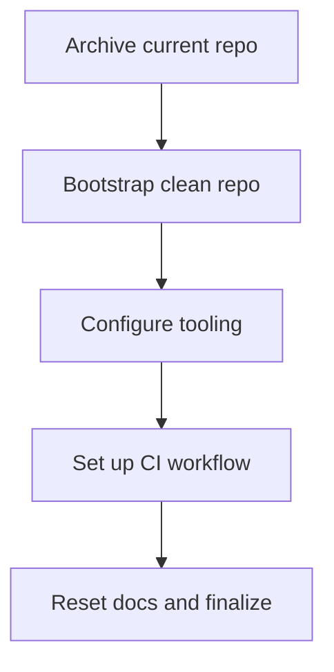

# Phase 0 Execution Blueprint

## 1. Archival Strategy
- Freeze the current main branch: announce a short code freeze, triage outstanding PRs, and tag the final monolith release (e.g., `v1.0.0-legacy`) for traceability.
- Provision the legacy repository: create a new remote `GeoAnomalyMapper-legacy`, push the full Git history, and set the default branch to `main` with the archival tag.
- Preserve scientific assets:
  - Snapshot critical directories (`docs/`, `tests/`, `data_sources.yaml`, `gam/_archived/`, scientific notebooks) into the legacy repo.
  - Generate an index of scientific formulas and data source references by exporting existing documentation references (e.g., notebooks, [`docs/scientific_methods.md`](GeoAnomalyMapper/docs/scientific_methods.md:1), [`docs/datasets/global_anomaly_catalog.md`](GeoAnomalyMapper/docs/datasets/global_anomaly_catalog.md:1)) and store it in the legacy README for later validation.
  - Archive large binary assets (COGs, datasets) to object storage with checksums; reference their storage locations in a legacy manifest.
- Update documentation pointers: add a prominent banner to [`README.md`](GeoAnomalyMapper/README.md:1) in the legacy repo clarifying archival status and pointing to the new clean-code repository.
- Decommission production workflows: disable existing CI/CD on the original repository, remove deployment secrets, and ensure security tooling is pointed to the legacy repo only for historical reference.

## 2. New Repository Foundation
- Repository skeleton:
  - Directories: `src/gam/`, `tests/`, `scripts/`, `iac/`, `docs/`.
  - Placeholder files: `src/gam/__init__.py`, `tests/__init__.py`, `scripts/README.md`, `iac/README.md`, `docs/README.md`, `.gitignore`, `README.md`.
- Dependency management:
  - Adopt a PEP 621 compliant [`pyproject.toml`](GeoAnomalyMapper/pyproject.toml:1) with `build-system` set to `setuptools` or `hatchling` plus `requirements-dev.txt` for tooling pinning, or standardize on Poetry with lockfile; decide during implementation.
  - Initialize version at `0.0.1` and use semantic versioning; maintain `src/gam/__version__.py`.
  - Encourage `uv` or `pipx` for virtual environment bootstrapping; document `python -m venv .venv` as the baseline.
- Environment bootstrap:
  - Provide `make` or `invoke` targets (e.g., `make install`, `make lint`, `make test`) as thin wrappers.
  - Pin core runtime dependencies to none (empty) in Phase 0; keep tooling isolated under `[project.optional-dependencies.dev]`.
  - Configure default branch protections and template PR/issue automation (e.g., `.github/pull_request_template.md`, issue templates).

## 3. Tooling Enforcement
- `pyproject.toml` configuration:
  - `[tool.black]`: line-length 88, target-version `py311`, include `src/` and `tests/`.
  - `[tool.isort]`: profile `black`, sections for `src` namespace, include `known_first_party = ["gam"]`.
  - `[tool.flake8]`: enable strict rules (E, F, W, B, C90) with `max-line-length = 88`, `select = ["E","F","W","B","C90"]`, `per-file-ignores` only for `__init__.py` exports.
  - `[tool.mypy]`: `python_version = 3.11`, `strict = True`, enable `warn_unused_configs`, `disallow_any_generics`, `warn_return_any`, `warn_unused_ignores`, enforce namespace package configuration for `src/gam`.
- Dedicated config files:
  - `mypy.ini` if separation preferred, ensuring same strictness.
  - `.flake8` only if multi-project; otherwise keep inside `pyproject`.
- Pre-commit hooks (`.pre-commit-config.yaml`):
  - `black`, `isort`, `flake8`, `mypy` (using `repo: local` and `language: system` to leverage installed env).
  - Additional hygiene hooks: `pre-commit-hooks` (trailing whitespace, end-of-file), `check-merge-conflict`, `detect-private-key`.
  - Configure `minimum_pre_commit_version` (e.g., `3.5.0`) and `default_stages` including `commit`, `push`.
- Local developer workflow:
  - Document `pre-commit install` in contributing guidelines.
  - Provide `make lint` invoking `pre-commit run --all-files` to align CLI usage with CI.

## 4. CI Pipeline (GitHub Actions)
- Workflow file: `.github/workflows/ci.yml`.
- Trigger: `push` & `pull_request` on `main` and feature branches.
- Job structure:
  - `lint` job: Python matrix (3.10, 3.11). Steps: checkout, setup Python, cache `.venv` or pip wheels, install dev dependencies, run `pre-commit run --all-files`.
  - `type-check` job: depends on `lint`, reuses restoration cache, executes `mypy src/ tests/`.
  - `test` job: depends on `lint`, installs `pytest` extras, runs `pytest --cov=src/gam --cov-report=xml`.
- Caching: use `actions/cache` keyed on `python-version` + hash of `pyproject.toml` & lockfile.
- Failure fast: enable `continue-on-error: false` to block merges; surface coverage artifact for future use.
- Ensure concurrency control (cancel in-progress runs on new commits) and add status badge pointing to new workflow in README once repo public.

## 5. Documentation Reset
- Remove legacy Markdown/RST content from new repo; maintain only placeholders referencing upcoming architecture.
- Author new `README.md` focusing on roadmap, development prerequisites, and link to archived repo.
- Create `CONTRIBUTING.md` skeleton covering environment bootstrap, coding standards (black/isort/flake8/mypy), testing, and PR process.
- Add `docs/` scaffolding:
  - `docs/index.md` with outline of planned sections.
  - `docs/decisions/0001-phase0-foundation.md` summarizing reset rationale and referencing legacy assets for scientific validation.
- Establish governance for documentation: set up `Documentation Lead` as owner for future Sphinx or MkDocs migration, but defer implementation to Phase 1.

## 6. Deliverables & Sequencing
### Milestone Checklist
| Milestone | Owner | Dependencies | Notes |
| --- | --- | --- | --- |
| Confirm archival scope & approvals | Tech Lead | None | Communicate freeze window to stakeholders. |
| Clone and tag legacy repo | DevOps Engineer | Confirm archival scope | Include documentation asset index and dataset manifest. |
| Stand up clean repository skeleton | Tech Lead | Legacy repo completed | Initialize versioning, branch protections, base README. |
| Implement tooling & pre-commit | DevOps Engineer | Repository skeleton | Validate config locally before pushing. |
| Author documentation placeholders | Documentation Lead | Repository skeleton | Reference legacy repo for historical context. |
| Configure CI workflow | DevOps Engineer | Tooling implemented | Ensure matrix passes against empty codebase. |
| Validate developer onboarding | Tech Lead & Data Scientist | CI configured | Smoke test `make install`, `pre-commit`, `pytest` with placeholder suite. |
| Final Phase 0 sign-off | Project stakeholders | All previous milestones | Capture lessons learned for Phase 1 planning. |

### Timeline Overview

## Open Questions & Assumptions
- Assumes leadership approves public access to the `GeoAnomalyMapper-legacy` repository; otherwise, establish private archival with restricted read access.
- Clarify whether large binary datasets can remain in the new repo or must stay external (object storage).
- Confirm packaging tool preference (setuptools vs Poetry) for the clean repo.
- Determine if sample tests or fixtures are desired in Phase 0 or deferred to Phase 1.
- Ensure that any regulatory or data-sharing constraints on scientific assets are documented before moving to the legacy repository.