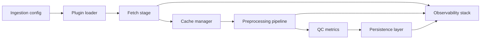

# Phase 2 Data Pipeline Backbone Outline

## 0. Context and Alignment
- Builds on the modular pipeline defined in [`GeoAnomalyMapper/docs/architecture.md`](GeoAnomalyMapper/docs/architecture.md:7) and the strict tooling/CI guardrails from [`Phase0_Execution_Blueprint.md`](Phase0_Execution_Blueprint.md:26).
- Reuses Phase 1 contracts (`RawData`, `ProcessedGrid`, `InversionResult`) from [`GeoAnomalyMapper/gam/core/data_contracts.py`](GeoAnomalyMapper/gam/core/data_contracts.py:12) and the stateless service interfaces in [`GeoAnomalyMapper/gam/services`](GeoAnomalyMapper/gam/services/__init__.py:1).

## 1. Ingestion Service Blueprint
- ### 1.1 Configuration-Driven Ingestion
  - **Config artifacts**: Consolidate modality definitions in `config/ingestion.yaml` (new) with schema enforced via Pydantic layer consolidating Phase 0 config rigor (`strict = True` enforced in CI).
  - **Definition format**: YAML sections per modality (e.g. `gravity`, `magnetic`) declaring source type, plugin id, rate limits, auth profile, cache policy, retry/circuit settings.
  - **Reload mechanics**: ConfigService extension watches file hash (`ConfigService` pattern in [`GeoAnomalyMapper/gam/core/config_service.py`](GeoAnomalyMapper/gam/core/config_service.py:1)) and hot-swaps via dependency-injected factory to avoid process restarts in long-running workers.
  - **Overrides**: Support CLI/env overrides by reusing Phase 1 `GAMConfig` approach with environment profiles.

- ### 1.2 Plugin System
  - **Registration**: Extend entry point groups introduced in Phase 1 (`gam.sources`) with metadata handshake; ingestion module on startup enumerates entry points and validates subclass of `IngestionServiceInterface` (`abc` contract at [`GeoAnomalyMapper/gam/services/ingestion_service.py`](GeoAnomalyMapper/gam/services/ingestion_service.py:14)).
  - **Interface contract**: `fetch(modality, bbox) -> RawData` returning Phase 1 Pydantic contract; enforce idempotence and no import-time side effects (aligned with adapter guidance at [`GeoAnomalyMapper/gam/ingestion/manager_adapter.py`](GeoAnomalyMapper/gam/ingestion/manager_adapter.py:19)).
  - **Dependency injection**: Orchestrator obtains plugins via factory and injects them into ingestion workers (`PipelineOrchestrator` extension at [`GeoAnomalyMapper/gam/core/orchestrator.py`](GeoAnomalyMapper/gam/core/orchestrator.py:12)); use `provider_map` keyed by modality to enable test doubles.
  - **Extensibility hooks**: Provide lifecycle events (pre-fetch, post-fetch) for provenance logging and caching hints.

- ### 1.3 Resilience and Observability
  - **Retry policies**: Apply `tenacity` with modality-specific settings (max attempts, jitter) defined in config; embed correlation ids for tracing.
  - **Circuit breakers**: Wrap plugin fetch call in bulkhead (concurrency limits) and optional circuit breaker (e.g., `pybreaker`) returning graceful degradation when third-party outages exceed thresholds.
  - **Timeout & rate limiting**: Configurable per modality using async-friendly wrappers (Phase 0 expectation on tooling for reliability).
  - **Observability hooks**: Emit structured logs and metrics following Phase 0 guardrails (JSON logs, metrics registry) – e.g., ingestion.fetch.success_count, latency histograms, circuit state transitions. Integrate with Prometheus config at [`GeoAnomalyMapper/monitoring/prometheus/gam-metrics.yml`](GeoAnomalyMapper/monitoring/prometheus/gam-metrics.yml:1).

- ### 1.4 Cache and Metadata Lifecycle
  - **Hot cache**: Stage data into Zarr/HDF5 caches under `data/cache/ingestion/<modality>/<hash>`; maintain TTL and version tag referencing plugin version.
  - **Metadata persistence**: For each fetch, persist manifest record (source URL, checksum, license) to PostgreSQL (see Section 3) and to JSON manifest as per Phase 1 provenance pattern (`data/outputs/manifest`).
  - **Eviction strategy**: TTL driven by config; background sweeper ensures disk limits enforced; allow manual pinning for high-value tiles.
  - **Integrity checks**: After caching, verify checksum vs manifest to guarantee reproducibility for downstream phases.

## 2. Preprocessing Service Blueprint
- ### 2.1 Processing Stages
  - **Filtering**: Noise/Outlier/Bandpass filters leveraging existing components at [`GeoAnomalyMapper/gam/preprocessing/filters.py`](GeoAnomalyMapper/gam/preprocessing/filters.py:1); each stage logs pre/post statistics.
  - **Gridding**: Use `RegularGridder` ([`GeoAnomalyMapper/gam/preprocessing/gridding.py`](GeoAnomalyMapper/gam/preprocessing/gridding.py:1)) to generate `ProcessedGrid` consistent with Phase 1 structure.
  - **Unit conversion**: `units.converter` ([`GeoAnomalyMapper/gam/preprocessing/units.py`](GeoAnomalyMapper/gam/preprocessing/units.py:1)) to harmonize units by modality.
  - **Quality control**: Introduce QC stage capturing data completeness, seam detection, flagged anomalies.
  - **Stage ownership**: Each stage implemented as `PreprocessingStage` class with `execute(raw) -> RawData | ProcessedGrid`.

- ### 2.2 Pipeline Composition Pattern
  - Adopt declarative pipeline definition (list of stage ids) stored in configuration, enabling dynamic sequencing.
  - Use command pattern: pipeline builder instantiates stage commands implementing `run(context)`; orchestrator composes per modality pipeline.
  - Support branching for multi-resolution processing (e.g., coarse & fine grids) using DAG runner (extend Phase 1 orchestrator to spawn Dask graph).
  - Provide DSL to define dependencies (e.g., `filter -> grid -> qc`).

- ### 2.3 Validation & Provenance
  - Insert validation checkpoints after each stage with schema assertions (e.g., `ProcessedGrid` dims, CRS, null ratio).
  - Capture provenance metadata: stage version, parameters, input/output hashes stored alongside dataset metadata tables.
  - Cross-check domain invariants (e.g., bounding box within request, grid resolution matches config, `ProcessedGrid` lat/lon monotonic).
  - Store stage timing metrics and attach to run manifest for performance regression detection.

- ### 2.4 Test Strategy Embedded
  - Provide stage-level unit test templates expecting deterministic input from `MockIngestionService` & `MockPreprocessingService` ([`GeoAnomalyMapper/gam/services/preprocessing_service.py`](GeoAnomalyMapper/gam/services/preprocessing_service.py:37)).
  - For dynamic pipelines, create golden pipeline definitions and compare hashed outputs using small fixtures.

## 3. Data Persistence Architecture
- ### 3.1 PostgreSQL/PostGIS Schema
  - **Core tables**:
    - `surveys`: id, modality, bbox geometry (Polygon), source_manifest_id, acquisition_window, ingest_status, created_at.
    - `grids`: id, survey_id FK, grid_version, resolution_deg, storage_uri (Zarr/HDF5 path), stats JSONB, grid_bbox geometry.
    - `models`: id, grid_id FK, model_type (e.g., fused, modality-specific), mesh_config JSONB, storage_uri.
    - `anomalies`: id, model_id FK, geom geometry(PointZ), confidence, anomaly_type, attributes JSONB.
    - `metadata`: generic key/value for pipeline runs (captures stage timing, provenance).
  - **Indexes**: GiST on geometries, btree on modality, created_at; partial indexes on anomaly_type for queries.
  - **Constraints**: Ensure referential integrity; use PostGIS `CHECK ST_IsValid(geom)`; enforce uniqueness on (survey_id, grid_version).

- ### 3.2 Zarr/HDF5 Cache Layout
  - Directory pattern: `data/cache/preprocessing/<modality>/<bbox_hash>/v<semver>/`.
  - Version directories track pipeline changes; TTL recorded in metadata manifest.
  - Concurrency handling: file locks via `zarr.ProcessSynchronizer` and advisory locks in Postgres for multi-worker writes.
  - S3-compatible layout mirror for remote cache with eventual replication (Phase 3 readiness).

- ### 3.3 Object Storage Conventions
  - Artifact bucket structure: `s3://gam-artifacts/<phase>/ingestion|preprocessing|models/<date>/<run-id>/`.
  - Naming: ISO8601 timestamp + bbox tag + modality; include README per run referencing manifest.
  - Lifecycle: Standard hot storage 90 days then transition to infrequent access; archives beyond 1 year to Glacier (configurable).
  - Data retention: Align with scientific reproducibility requirements; maintain manifest with DOIs/citations when available.

- ### 3.4 Backup, Restore, Migration
  - Database backups via PITR enabled by managed service; weekly schema snapshot.
  - Cache backup optional (reproducible via re-run) but maintain manifest to reconstruct.
  - Migrations: Use Alembic templates abiding by Phase 0 CI to run `alembic upgrade head` in pipeline; integrate with deploy sequencing to gate on migration success.
  - Disaster recovery drill documented (restore Postgres, rehydrate caches from object storage).

## 4. Testing Strategy
- **Unit Tests**:
  - 90% coverage target for ingestion/preprocessing modules; mocks for external APIs using plugin dependency injection.
  - Validate config parsing, retry logic, error branching.
- **Integration Tests**:
  - End-to-end pipeline with local fixtures (small bounding boxes) verifying ingestion → preprocessing → persistence.
  - Use ephemeral Postgres (Testcontainers) and temporary filesystem to assert caching/outcome.
- **Test Data Management**:
  - Store curated fixtures under `tests/data/phase2/` with manifest for provenance.
  - Provide dataset generator scripts aligned with Phase 0 `make` targets.
- **Continuous Testing in CI**:
  - Extend `.github/workflows/ci.yml` to include Phase 2 test matrix (serial and parallel runs).
  - Add nightly performance regression job measuring pipeline throughput against baseline.
- **Performance Benchmarks**:
  - Track ingestion latency per modality, pipeline throughput, memory usage; log to metrics for gating alerts.

## 5. Operational Considerations
- **Orchestration Tooling**:
  - Adopt Dask for parallel stage execution (per Phase 1 pattern) with optional Celery for scheduling periodic ingests.
  - Provide worker profiles (CPU vs IO heavy) with configuration bridging to Kubernetes manifests.
- **Monitoring & Logging**:
  - Metrics: ingestion success rate, retry counts, cache hit ratio, stage durations, queue depth.
  - Logs: structured JSON with trace ids, pipeline stage tags; integrate with Grafana dashboards (`monitoring/grafana`).
- **Security**:
  - Centralized secrets via Phase 0 guidelines (no secrets in repo); fetch from environment/secret store.
  - API keys stored in Vault/KeyVault; rotate via config reload.
  - Validate inputs to prevent injection; ensure TLS for data transfers where possible.
- **Deployment Sequencing**:
  - Sequence: 1) Apply DB migrations; 2) Deploy ingestion workers; 3) Deploy preprocessing workers; 4) Activate orchestrator; 5) Enable scheduled jobs.
  - Blue/green rollout for pipeline components with canary bounding boxes.

## 6. Assumptions, Risks, Open Questions
- **Assumptions**:
  - Dask remains primary parallelism engine; HPC integration deferred.
  - Object storage available with versioning support.
  - Phase 1 interfaces remain stable (no breaking changes to `RawData`, `ProcessedGrid`).
- **Risks**:
  - Third-party data outages impacting ingestion; mitigated via circuit breakers and fallback caches.
  - Cache corruption under concurrent writes; mitigated via synchronizers and integrity checks.
  - Schema evolution complexity; requires robust migration governance.
- **Open Questions** (to align with Geophysicist/Pipeline Engineer):
  1. Required latency for near-real-time ingestion? Determines retry/circuit thresholds.
  2. Preferred data retention duration for raw vs processed caches?
  3. Are there modality-specific QC rules beyond generic thresholds?
  4. Do we need multi-resolution outputs in Phase 2 or defer to later phases?
  5. Confirm regulatory/licensing requirements for storing raw datasets long-term.

## 7. Visual Overview

## 8. Next Steps Toward Implementation
- Finalize schema & config formats with stakeholders.
- Prototype plugin loading and config reload mechanism.
- Implement pipeline builder with command pattern and integrate validations.
- Stand up staging Postgres/Zarr stores; dry-run integration tests.
- Review operational playbooks and align deployment timeline with Phase 3 planning.