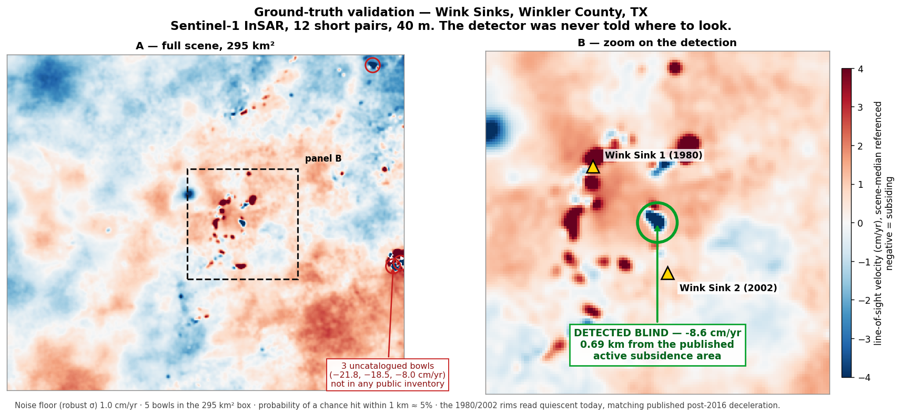
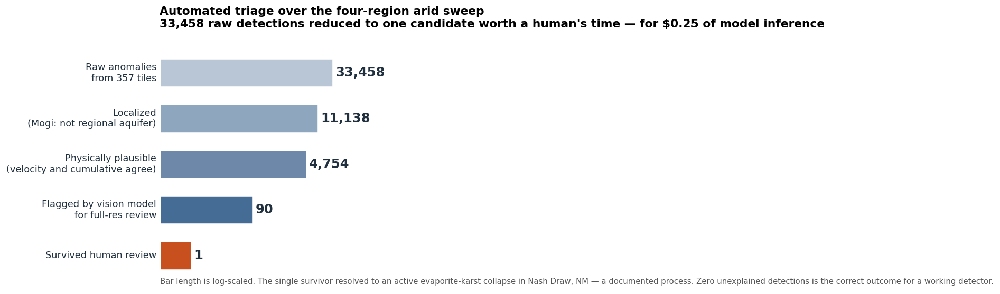

# GeoAnomalyMapper

**Finds ground that is moving, using only free satellite radar.** Growing
sinkholes, dissolving salt beds, settling mine workings, induced subsidence —
detected, classified, and forecast from NASA's public InSAR archives.



That is the system's ground-truth test. Given a 295 km² box in Winkler County,
Texas and no hint where to look, it recovered the documented actively-subsiding
area **0.69 km from its published location** — and flagged three more bowls
that are in no public inventory.

---

## What it actually does

Satellites have been mapping ground displacement over North America every 12
days since 2016, at 30 m and millimetre precision. That archive is free, and
almost nobody mines it systematically because the data is awkward and the
false-positive rate is brutal.

This project does three things:

1. **Ingests** OPERA DISP-S1 time series (9.5-year histories) and on-demand
   HyP3 interferograms, with caching and fallbacks that make continental-scale
   sweeps practical on one machine.
2. **Detects and classifies** — per-pixel velocity, *acceleration* (the
   collapse precursor), seasonal separation, regime change, and Mogi source
   inversion to tell a localized bowl apart from a regional aquifer sheet.
3. **Triages** the output down to something a human can actually read.

That last step is the hard one. A four-region sweep of the arid US produced
33,458 raw detections. Here is what survived:



The pipeline is physics gates → geometry classification → vision-model review →
human. Total inference cost for the vision passes: **$0.25**.

---

## What is validated, and what failed

Every capability claim here is backed by a ground-truth experiment. Approaches
that failed validation were **removed from the codebase**, not quietly left in.
That history is documented because it defines what the surviving system can
honestly claim.

| Approach | Ground-truth test | Status |
|---|---|---|
| **InSAR surface deformation** (current system) | Wink TX (2 independent pipelines), Tampa "Sinkhole Alley", Central Valley discrimination | **Validated** — recovered documented subsidence at 0.69 km; noise floor 0.19 cm/yr over 9.5 yr |
| Single-pass SAR Doppler "vibrometry" | Carlsbad Caverns vs. barren-plains control, real Sentinel-1 SLC | **Failed, removed** — outputs were site-independent artifacts (both sites ~97% "void") |
| Gravity + magnetics fusion for void detection | Raw-data contrast at 14 known caves/mines | **Failed at feature scale** — 2–20 km resolution carries no information about ~100 m voids |
| District-scale mineral prospectivity (legacy) | None reproducible in this repository | **Unverified** — historical enrichment/hit-rate figures are not backed by auditable artifacts. Do not cite them. |

**The physics that bounds everything:** this system sees ground that is
**moving**. An actively growing void, dissolving salt bed, or compacting
aquifer produces measurable surface motion. A *static, finished* cavity — a
stable cave, a completed tunnel — produces none, and is invisible to this and
to every other public-data method tested here.

### Other validated results

- **Tampa / Spring Hill, FL** — 42 localized, accelerating, Mogi-consistent
  candidates at karst depths, in the most sinkhole-insured region of the US.
- **Central Valley, CA** (discrimination test) — correctly labels the famous
  aquifer-compaction province as *regional* (201 of 264 detections) rather than
  misreporting it as void collapse. Knowing what *not* to flag is the product.

---

## Architecture

```
deformation_intel/     the validated core
├── opera.py           OPERA DISP-S1 ingestion — windowed reads, 3-tier
│                      acquisition fallback, on-disk caching, frame stitching
├── timeseries.py      velocity, ACCELERATION, seasonal separation,
│                      regime-change detection, forecasting
├── sources.py         Mogi inversion: bowl geometry -> depth + volume rate
│                      (this is the localized-vs-regional discriminator)
├── detect.py          unified detector -> {accelerating / steady / regional /
│                      seasonal / uplift} + confidence + plain-language reason
└── sweep.py           region-scale tiled sweeps

tools/insar_prototype/ HyP3 short-pair stacks — the complementary channel for
                       FAST deformation that OPERA's quality masking deletes
                       (proven necessary at Wink)
interesting_intel/     general "worth a glance" ranker over free imagery
archaeo_intel/         archaeology surface-proxy channel + CORONA film module
blind_validation.py    blind-validation harness: frozen candidates, withheld
                       labels, hash-pinned reproducibility
```

The two motion channels are complementary by physics: OPERA gives mm-precision
9.5-year histories for slow motion (and therefore *prediction* — acceleration
and time-to-threshold), while on-demand HyP3 interferograms catch fast, fresh
deformation that decorrelates out of OPERA's masks.

---

## Quickstart

```bash
pip install -e ".[dev]"
```

```bash
python geoanomaly.py health --json --skip-gpu
```

The analytics engine is testable without any download or credentials —
synthetic-signal round trips through the real detector:

```bash
pytest tests/test_deformation_timeseries.py tests/test_deformation_sources.py tests/test_deformation_detect.py -q
```

For real data you need a free [Earthdata account](https://urs.earthdata.nasa.gov);
copy `.env.example` to `.env` and fill in the credentials. Then:

```python
from deformation_intel.opera import build_aoi_cube
from deformation_intel.detect import detect_anomalies

cube = build_aoi_cube(31.769, -103.102, half_width_km=12.0,
                      cache_dir="window_cache")
for a in detect_anomalies(cube)[:10]:
    print(a.rank, a.classification, a.peak_velocity_cm_yr, "cm/yr",
          a.source_depth_m, "m", a.why)
```

Regenerate the figures above with `python tools/make_readme_figures.py`.

---

## CORONA: free 1960s ~2 m spy imagery in five lines of Python

Probably the most immediately reusable standalone piece here.
[`archaeo_intel/corona.py`](archaeo_intel/corona.py) reads the CAST **CORONA
Atlas** open archive — 217 declassified US reconnaissance missions (1960–72,
KH-4B at ~1.8 m) — with no account and no bulk downloads: whole-strip previews
in ~2 s via HTTP range reads, full-resolution windowed crops, a
ground-control-point workflow with per-point residual QC, panoramic distortion
fitting, and warping straight to a QGIS-ready GeoTIFF.

The frames pre-date mechanized agriculture and modern conflict, so landscapes
long erased on the ground are often crisply visible. Tutorial:
**[docs/CORONA.md](docs/CORONA.md)**. Credit the
[CORONA Atlas project](https://corona.cast.uark.edu) (CAST, University of
Arkansas) when you use the data, and be kind to their bandwidth.

---

## Data sources (all free)

| Source | What it gives | Coverage |
|---|---|---|
| **OPERA DISP-S1** (NASA/JPL) | L3 InSAR displacement time series, 30 m | North America, 2016→now |
| **ASF HyP3** | on-demand Sentinel-1 interferometry | global, quota-limited |
| **Sentinel-1 SLC** via ASF | raw scenes for custom processing | global |
| **NAIP / Sentinel-2 / Copernicus DEM** | imagery + terrain for triage | US 1 m / global 10 m / global 30 m |

---

## Known limitations

- Velocities are **line-of-sight**, single-geometry — not pure vertical.
  Ascending/descending decomposition is on the roadmap.
- The localized-vs-regional discriminator *reduces* but does not eliminate
  aquifer-pumping false positives. A groundwater/seasonality rejection layer is
  the next planned addition.
- Anomaly lists are **candidates for investigation, not confirmed voids**.
  Confirmation requires ground methods: microgravity, ERT, drilling.
- Coverage, not sensitivity, is the binding constraint. OPERA is North America
  only, and vegetated terrain decorrelates.
- Run the deformation tests in a separate pytest process from any torch-based
  suite (native DLL load-order conflict on Windows).

---

## Documentation

| Doc | What it's for |
|---|---|
| [docs/CRITIQUE.md](docs/CRITIQUE.md) | Adversarial self-review — known weaknesses, with fix status |
| [docs/CORONA.md](docs/CORONA.md) | CORONA imagery tutorial |
| [docs/DISCOVERY_SOP.md](docs/DISCOVERY_SOP.md) | Rules a candidate must clear before it is called anything |
| [docs/notebook/](docs/notebook/) | The lab notebook — every experiment, including the dead ends |

## License

Proprietary — see [LICENSE](LICENSE).
