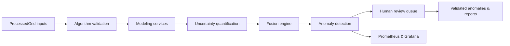

# Scientific Core Architecture Overview

This document captures the production architecture that governs GeoAnomalyMapper's scientific engine: validation, inversion services, fusion, anomaly detection, and governance. It reflects the system exactly as deployed today.

## 1. Algorithm Validation Framework
- **Method briefs** – Every algorithm ships with a scientific brief referencing peer-reviewed literature and listing governing equations, assumptions, and boundary conditions.
- **Deterministic testing** – Unit tests enforce analytic tolerances (e.g., gravity inversion residual < 1e-6), property-based tests cover symmetry and conservation, and regression suites guard golden outputs.
- **Traceability** – Each algorithm carries a semantic version stored alongside metadata in the PostgreSQL `models` table; validation reports are archived to `s3://gam-artifacts/algorithms/<version>/` and linked from CI badges.

## 2. Modeling Service Architecture
- **Service interface** – `gam.services.modeling_service.ModelingService` consumes ProcessedGrid handles and produces versioned InversionResult objects.
- **Execution backend** – Distributed scheduling via Dask orchestrates SimPEG (default) and PyGIMLi (optional) engines; CPU/GPU routing is declared in configuration and honoured by the job queue.
- **Mesh management** – `gam.modeling.mesh` generates tetrahedral or hexahedral meshes with metadata persisted in `models.mesh_config` for reproducibility.

## 3. Uncertainty Quantification and Diagnostics
- **Uncertainty storage** – Posterior covariance, bootstrap spreads, and ensemble variance are stored in `InversionResult.uncertainty` xarray datasets with full provenance metadata.
- **Diagnostics** – Visualization utilities in `gam.visualization.plots` produce residual histograms, convergence curves, and sensitivity heatmaps, exported to `data/outputs/reports/<run-id>/`.
- **Observability** – Prometheus exporters track inversion latency, residual RMS, and queue depth; Grafana dashboards render these metrics for operations teams.

## 4. Fusion and Anomaly Detection
- **Fusion engine** – `gam.modeling.fusion` blends multiple inversions using physics-weighted, Bayesian, or rule-based strategies, emitting ProcessedGrid-compatible xarray datasets.
- **Detection strategies** – `gam.modeling.anomaly_detection` hosts rule-based (threshold, gradient), statistical (Mahalanobis), and machine-learning (isolation forest) detectors with calibrated confidence scores.
- **Human review** – Anomalies enter a review queue backed by PostgreSQL with auditable approval/rejection workflows and operator annotations.

## 5. Testing and Reproducibility Controls
- **Test matrix** – Unit, integration, and performance benchmarks cover the full pipeline from ProcessedGrid ingestion to anomaly export; thresholds are encoded in CI gating rules.
- **Seed management** – All stochastic stages persist seeds in metadata, ensuring deterministic reruns; containerised execution environments are versioned per release.
- **Provenance** – Configuration, code, and data manifests are version-controlled together, enabling byte-for-byte reproduction of historical deliveries.

## 6. Governance and Collaboration
- **Approval workflow** – Releases require sign-off from the Geophysicist (scientific integrity), Pipeline Engineer (operational readiness), and QA Lead (test coverage).
- **Documentation** – Scientific briefs, inversion runbooks, and anomaly detection playbooks live under `docs/` and are updated with every release.
- **Stakeholder cadence** – Bi-weekly coordination sessions synchronise modeling, pipeline, and observability teams to prioritise enhancements and mitigate risk.

## 7. Risk Management
- **Numerical stability** – Continuous monitoring detects solver divergence, mesh quality degradation, or conditioning issues; automated mitigations include adaptive damping and mesh refinement suggestions.
- **Resource contention** – Scheduler enforces quotas and allocates GPU workloads to dedicated pools; backpressure integrates with the observability stack.
- **Model drift** – Scheduled re-validations benchmark algorithms against newly ingested datasets and halt promotion when metrics fall outside tolerance.

## 8. System Flow (Mermaid)

*Updated: October 2025*
