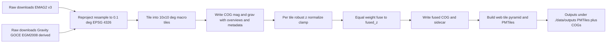

# GeoAnomalyMapper (GAM) System Architecture

## 1. Overall System Architecture

### 1.1 Data Flow Patterns

GAM employs a linear, modular pipeline architecture with clear data flow between modules, ensuring loose coupling and high cohesion. The primary workflow is:

- **Ingestion → Preprocessing**: Raw data fetched from public sources is cached and passed as `RawData` objects (Dict[str, Any] with metadata and values as np.ndarray or xarray.Dataset).
- **Preprocessing → Modeling**: Processed data is gridded into `ProcessedGrid` (xarray.Dataset with dimensions lat, lon, depth/time) and fed into modality-specific inverters.
- **Modeling → Visualization**: Inversion results (`InversionResults` Dict with model, uncertainty) are fused into `AnomalyOutput` (pd.DataFrame with columns: lat, lon, depth, confidence, anomaly_type), then rendered/exported.

For global processing, the core module tiles the bounding box (e.g., 10° chunks from config) and parallelizes via Dask, merging results post-fusion.

**Implementation Details**: Data flow uses xarray for geospatial arrays (netCDF-compatible), pandas for tabular anomalies. Libraries: NumPy/SciPy for computations, PyProj for projections. Design decision: xarray chosen for lazy loading and multi-dimensional slicing, essential for large global datasets.

High-level flowchart (Mermaid):

```mermaid
flowchart TD
    A[External Data Sources<br/>USGS, IRIS, ESA] --> B[Ingestion Module<br/>fetch_data(bbox, modality)]
    B --> C[Cache Manager<br/>HDF5/SQLite Store]
    C --> D[Preprocessing Module<br/>preprocess(raw_data, grid_res)]
    D --> E[Modeling Module<br/>invert_modality(data), fuse_models(models)]
    E --> F[Anomaly Detection<br/>detect_anomalies(fused_model, threshold)]
    F --> G[Visualization Module<br/>generate_map(anomalies, type)]
    G --> H[Outputs: Maps, Exports<br/>GeoTIFF, VTK, SQL]
    I[Core Pipeline Orchestrator<br/>run_pipeline(bbox, modalities)] -.-> B
    I -.-> D
    I -.-> E
    I -.-> G
    J[Dask Scheduler<br/>delayed tasks, persist] -.->|Parallel| D
    J -.-> E
    J -.-> F
```

Sequence diagram for main workflow (Mermaid):


**Data Flow Documentation**: Raw data (e.g., JSON from USGS) → RawData (parsed with requests/ObsPy) → Cached (HDF5 for arrays, SQL for metadata) → Processed (SciPy filters, xarray regrid) → Inverted (SimPEG/PyGIMLi solvers) → Fused (custom Bayesian, weights from config) → Detected (SciPy stats.zscore) → Visualized (PyGMT/PyVista renderers). Flows are typed (e.g., RawData to xarray.Dataset), with validation at each step.

### 1.2 Error Handling and Logging Strategies

- **Custom Exceptions**: Define hierarchy in `gam/core/exceptions.py` (see section 6).
- **Recovery**: Use `@retry` decorators (from tenacity) with exponential backoff for API fetches/inversions. For parallelism, Dask retries failed tasks automatically.
- **Logging**: Use Python's `logging` module with structured format (JSON via `python-json-logger`). Levels: DEBUG (detailed ops), INFO (progress), WARNING (recoverable), ERROR (failures). Central logger in core, propagated to modules. Example config in `config.yaml`: `logging_level: "INFO"`. Logs to file (`logs/gam.log`) and console.

**Implementation Details**: Logging uses `logging.getLogger(__name__)` per module. Structured extras include bbox, modality for filtering. Design decision: JSON format for machine-readable logs, integrable with ELK stack for production.

Example logger usage:
```python
import logging
logger = logging.getLogger(__name__)
logger.info("Pipeline started", extra={"bbox": bbox, "modalities": modalities})
```

### 1.3 Configuration Management

- **Approach**: YAML-based (PyYAML for loading). Validate schemas using Pydantic (BaseModel for sections) or Cerberus for nested dicts. Load in core: `config = load_and_validate('config.yaml')`.
- **Schema**: Extend existing `config.yaml` structure. Global keys: version, logging_level. Data: bbox (List[float]), modalities (List[str]), cache_dir (str). Preprocessing: grid_res (float), filter_params (Dict). Modeling: inversion_type (str), threshold (float), priors (Dict). Visualization: map_type (str), export_formats (List[str]). Core: output_dir (str), parallel_workers (int), tile_size (int).
- **Dynamic Loading**: Support overrides via CLI args/env vars. For data sources, separate `data_sources.yaml` with validation for URLs/auth.

**Implementation Details**: Pydantic models in `gam/core/config.py` (e.g., GAMConfig(BaseModel)). Env var parsing with `os.getenv` or python-dotenv. Design decision: Pydantic for runtime validation and IDE autocompletion, over Cerberus for simplicity.

### 1.4 Caching and Persistence Strategies

- **HDF5 for Raw/Processed Data**: Use h5py for large arrays. CacheManager ABC (see section 2) with `store(key: str, data: Any)` and `retrieve(key: str) -> Any`. Keys: f"{modality}_{bbox_hash}_{timestamp}". Compress with gzip.
- **SQLite for Metadata/Anomalies**: SQLAlchemy ORM for tables (e.g., anomalies: id, lat, lon, depth, confidence). Sessions managed in core for transactions.
- **Persistence Policy**: Cache raw data indefinitely (unless expired via config), processed for session duration. Use Dask.persist() for in-memory caching during runs.

**Implementation Details**: HDF5Cache uses h5py.File with datasets for arrays, attributes for metadata. SQLCache uses declarative_base for models. Design decision: HDF5 for binary efficiency (compression 5-10x), SQLite for queryable metadata (e.g., SELECT * FROM anomalies WHERE confidence > 0.8).

### 1.5 Parallel Processing Coordination using Dask

- **Integration**: Core uses `dask.delayed` for module functions, `dask.distributed.Client` for cluster (local or cloud). For tiling: `futures = [delayed(run_pipeline)(tile) for tile in tiles]; results = compute(futures)`.
- **Coordination**: Task graphs in core.pipeline: ingestion (bag for fetches), preprocessing (array for gridding), modeling (delayed inversions). Visualize graphs with `dask.visualize()`.
- **Scalability**: Configurable workers (`parallel_workers: -1` for all cores). For global, use dask-jobqueue for HPC/cloud.

**Implementation Details**: Client = Client(n_workers=parallel_workers, memory_limit='4GB'). Design decision: Dask over Joblib for lazy computation and distributed scaling (e.g., Kubernetes integration for cloud).

## 2. Abstract Base Classes and Interfaces

Define in `gam/core/interfaces.py` using `abc` module with type hints (Python 3.10+).

### 2.1 Data Sources (ABC)
```python
from abc import ABC, abstractmethod
from typing import Dict, Any, Tuple
from dataclasses import dataclass

@dataclass
class RawData:
    metadata: Dict[str, Any]
    values: Any  # np.ndarray or xarray.Dataset

class DataSource(ABC):
    """Abstract base for geophysical data fetchers."""
    
    @abstractmethod
    def fetch(self, bbox: Tuple[float, float, float, float], params: Dict[str, Any]) -> RawData:
        """
        Fetch raw data for given bbox and params.
        
        :param bbox: (min_lat, max_lat, min_lon, max_lon)
        :param params: Modality-specific (e.g., date range)
        :return: RawData object
        :raises DataFetchError: If fetch fails
        """
        pass
```

Subclasses: `GravitySource(DataSource)` (requests to USGS), `SeismicSource(DataSource)` (ObsPy FDSN), etc. **Implementation**: GravitySource uses requests.get with bbox formatting; SeismicSource uses obspy.clients.fdsn.Client('IRIS').

### 2.2 Preprocessors (Interface)
```python
from typing import Optional
import xarray as xr

class Preprocessor(ABC):
    """Interface for data cleaning, filtering, gridding."""
    
    @abstractmethod
    def process(self, raw_data: RawData, grid_res: float, config: Dict[str, Any]) -> xr.Dataset:
        """
        Process raw data into gridded format.
        
        :param raw_data: From DataSource
        :param grid_res: Resolution in degrees
        :param config: Filter params
        :return: ProcessedGrid as xarray.Dataset with coords ['lat', 'lon', 'depth']
        """
        pass
```

**Implementation**: GravityPreprocessor uses scipy.ndimage.gaussian_filter; SeismicPreprocessor uses obspy.signal.filter.

### 2.3 Inverters (Abstract Interface)
```python
from typing import List
import simpeg  # SimPEG integration

class Inverter(ABC):
    """Abstract interface for geophysical inversion algorithms."""
    
    @abstractmethod
    def invert(self, processed_grid: xr.Dataset, mesh: simpeg.Mesh, priors: Dict[str, Any]) -> Dict[str, Any]:
        """
        Perform inversion for a modality.
        
        :param processed_grid: Gridded data
        :param mesh: SimPEG mesh
        :param priors: Inversion priors (e.g., regularization)
        :return: InversionResults {'model': simpeg.Model, 'uncertainty': np.ndarray}
        :raises InversionConvergenceError: If not converged
        """
        pass
    
    @abstractmethod
    def fuse(self, models: List[Dict[str, Any]], joint_weight: float) -> xr.Dataset:
        """
        Joint fusion of multiple modality models.
        
        :param models: List of InversionResults
        :param joint_weight: Bayesian fusion weight
        :return: Fused model as xarray.Dataset
        """
        pass
```

**Implementation**: GravityInverter uses simpeg.potential_fields.gravity; Fusion uses custom Bayesian update with scipy.stats.norm.

### 2.4 Visualizers (Interface)
```python
from typing import Union
import matplotlib.pyplot as plt
import folium

class Visualizer(ABC):
    """Interface for different output formats."""
    
    @abstractmethod
    def render(self, anomalies: pd.DataFrame, output_type: str, config: Dict[str, Any]) -> Union[plt.Figure, folium.Map, str]:
        """
        Generate visualization.
        
        :param anomalies: AnomalyOutput DataFrame
        :param output_type: '2d', '3d', 'interactive'
        :param config: Viz params (e.g., color_scheme)
        :return: Figure, Map, or file path
        """
        pass
```

**Implementation**: Map2DVisualizer uses pygmt.Figure; Volume3DVisualizer uses pyvista.Plotter.

### 2.5 Cache Managers (Interface)
```python
import h5py
from sqlalchemy import Engine

class CacheManager(ABC):
    """Interface for HDF5 and database storage."""
    
    @abstractmethod
    def store(self, key: str, data: Any, compress: bool = True) -> None:
        """Store data by key (HDF5 or DB)."""
        pass
    
    @abstractmethod
    def retrieve(self, key: str) -> Optional[Any]:
        """Retrieve data by key."""
        pass
    
    @abstractmethod
    def delete(self, key: str) -> None:
        """Delete cached data."""
        pass
```

Implementations: `HDF5Cache(CacheManager)` (h5py with blosc compression), `SQLCache(CacheManager)` (SQLAlchemy with SQLite).

## 3. Data Structures and Schemas

### 3.1 Raw Geophysical Data Format
Standardized internal representation: `RawData` dataclass (see 2.1). Keys: 'metadata' (Dict: source, timestamp, bbox, units), 'values' (modality-specific: e.g., gravity as np.ndarray of shape (n_points,)), seismic as ObsPy Stream.

**Implementation**: Parsed from API (e.g., USGS GeoJSON to np.array via geopandas.read_file).

### 3.2 Processed Grid Data Structure
`ProcessedGrid`: xarray.Dataset with:
- Dims: lat (n_lat), lon (n_lon), depth (n_depth) or time.
- Vars: 'data' (float32, e.g., gravity anomaly), 'uncertainty' (optional).
- Coords: lat/lon/depth (float64), crs='EPSG:4326'.
- Attrs: units, grid_res, processed_at.

**Implementation**: Created with xr.Dataset({'data': (['lat', 'lon'], grid_array)}, coords={'lat': lats, 'lon': lons}).

### 3.3 Inversion Model Results Format
`InversionResults`: Dict[str, Any] = {
    'model': simpeg.Model or np.ndarray (shape: n_cells),
    'uncertainty': np.ndarray (std dev),
    'converged': bool,
    'iterations': int,
    'residuals': np.ndarray
}

**Implementation**: From simpeg.Inversion3D.run(m0=priors['initial_model']).

### 3.4 Anomaly Detection Output Schema
`AnomalyOutput`: pd.DataFrame with columns:
- lat (float), lon (float), depth (float, meters)
- confidence (float, 0-1)
- anomaly_type (str, e.g., 'void', 'fault')
- score (float, z-score)
- modality_contributions (Dict[str, float])

Index: unique anomaly_id.

**Implementation**: pd.DataFrame(anomaly_points, columns=...) with type from heuristics (e.g., depth < -100 → 'void').

### 3.5 Configuration File Schemas (YAML Validation)
Use Pydantic model in core:
```python
from pydantic import BaseModel, Field
from typing import List, Dict, Any

class GlobalConfig(BaseModel):
    version: str = Field(..., description="GAM version")
    logging_level: str = Field("INFO", regex="^(DEBUG|INFO|WARNING|ERROR)$")

class DataConfig(BaseModel):
    bbox: List[float] = Field(..., min_items=4, max_items=4)
    modalities: List[str] = Field(default=["all"])

# Similarly for other sections...
class GAMConfig(BaseModel):
    global: GlobalConfig
    data: DataConfig
    # ... other sections
```

Validate: `GAMConfig(**yaml.safe_load(f))`.

For data_sources.yaml: Similar nested models for each modality (base_url: str, client_type: str, etc.).

**Implementation**: Validation in load_config; errors raise ValueError with path (e.g., "data.bbox: invalid length").

## 4. Plugin System for Extensibility

### 4.1 How New Data Sources Can Be Added
- **Discovery**: Use setuptools entry_points: In setup.py, `entry_points={'gam.sources': ['gravity = gam.ingestion.sources:GravitySource']}`.
- **Registration**: Users create subclass of DataSource, install as plugin package, register in entry_points.
- **Loading**: In core: `from importlib_metadata import entry_points; sources = {ep.name: ep.load() for ep in entry_points(group='gam.sources')}`.
- **Example**: New 'muon' source: Create `muon_fetcher.py` with MuonSource(DataSource), package it, pip install.

**Implementation Details**: Dynamic loading in ingestion.manager; validate subclass with isinstance(source, DataSource). Design decision: Entry points for discoverability without modifying core code.

### 4.2 How New Inversion Algorithms Can Be Integrated
- Similar entry_points: 'gam.inverters' group.
- Core loads: `inverters = {name: load() for name in entry_points('gam.inverters')}`.
- Selection via config: `inversion_type: "custom_muon"`.
- Fusion: Plugins must implement fuse if joint.

**Implementation**: modeling.manager uses factory: `inverter = inverters[config['modeling']['inversion_type']]()`.

### 4.3 How New Visualization Formats Can Be Supported
- Entry_points: 'gam.visualizers'.
- Dynamic loading in visualization module: Select by `map_type` in config.
- Example: Add 'ar' (augmented reality) via plugin with ARVisualizer(Visualizer).

**Implementation**: visualization.manager: `viz = visualizers[config['visualization']['map_type']]()`.

Best Practice: Plugins must adhere to interfaces; validate on load with ABC checks. Design decision: Plugins enable community extensions (e.g., new modalities like LiDAR).

## 5. Error Handling Hierarchy

### 5.1 Custom Exception Classes
In `gam/core/exceptions.py`:
```python
class GAMError(Exception):
    """Base for all GAM exceptions."""

class DataFetchError(GAMError):
    """Raised for API/data source failures."""
    def __init__(self, source: str, message: str):
        self.source = source
        super().__init__(f"Fetch failed for {source}: {message}")

class PreprocessingError(GAMError):
    """Data alignment/filtering issues."""

class InversionConvergenceError(GAMError):
    """Inversion did not converge."""
    def __init__(self, iterations: int, residual: float):
        super().__init__(f"Inversion failed after {iterations} iterations, residual: {residual}")

class CacheError(GAMError):
    """Storage/retrieval failures."""

# Usage: raise DataFetchError("USGS", "Timeout")
```

**Implementation**: Exceptions logged with traceback; CLI exits with code 1.

### 5.2 Error Recovery Strategies
- **Retry Logic**: Decorator `@retry(stop=stop_after_attempt(3), wait=wait_exponential(multiplier=1, min=4, max=10))` on fetch/invert.
- **Fallbacks**: If modality fails, skip and log WARNING, continue with others. For global tiling, isolate failed tiles.
- **Graceful Degradation**: Reduce resolution if memory error; use single-thread if Dask fails.

**Implementation**: Tenacity for retries; try-except in pipeline.orchestrator for fallbacks.

### 5.3 Logging Levels and Structured Format
- **Levels**: DEBUG (API responses), INFO (step progress, e.g., "Fetched 1000 gravity points"), WARNING (skipped data), ERROR (exceptions with traceback).
- **Format**: JSON: `{"timestamp": "ISO", "level": "INFO", "module": "ingestion", "message": "...", "extra": {...}}`.
- **Implementation**: `logging.basicConfig(level=config['global']['logging_level'], handlers=[JSONHandler()])`. Use loguru for easier structured logging if added to requirements.

Design decision: Structured logs for observability in production (e.g., Datadog integration).

## 6. API Contracts Between Modules

### 6.1 Function Signatures and Return Types
- **Ingestion**: `fetch_data(bbox: Tuple[float, ...], modality: str, params: Dict[str, Any] = {}) -> RawData`. Raises DataFetchError.
- **Preprocessing**: `process(raw_data: RawData, grid_res: float, filter_params: Dict) -> xr.Dataset`. Returns ProcessedGrid.
- **Modeling**: `invert_modality(modality: str, grid: xr.Dataset, mesh_config: Dict) -> InversionResults`; `fuse_models(results: List[InversionResults], priors: Dict) -> xr.Dataset`; `detect_anomalies(model: xr.Dataset, threshold: float) -> pd.DataFrame`.
- **Visualization**: `generate_map(anomalies: pd.DataFrame, type: str, export_formats: List[str]) -> Dict[str, str]` (paths to outputs).
- **Core**: `run_pipeline(bbox: Tuple, modalities: List[str], config_path: str) -> Dict[str, Any]` (results summary).

**Implementation**: All use type hints; mypy enforced in CI.

### 6.2 Expected Input/Output Data Formats
- I/O: Use xarray for geospatial (netCDF-like), pandas for tabular, np.ndarray for arrays. Serialize with to_netcdf() for persistence.
- Validation: Type hints + runtime checks (e.g., assert isinstance(data, xr.Dataset)).

### 6.3 Configuration Parameter Specifications
- Passed as Dict slices from YAML (e.g., modeling_priors = config['modeling']['priors']).
- Defaults in core if missing.

### 6.4 Event/Callback Mechanisms for Progress Reporting
- Simple callbacks: `def progress_callback(step: str, percent: float): logger.info(f"{step}: {percent}%")`.
- Advanced: Use `tqdm` for CLI progress bars. For parallelism, Dask progress via `from dask.diagnostics import ProgressBar`.

**Implementation**: PipelineOrchestrator accepts callback=progress_callback.

## 7. Parallel Processing Architecture

### 7.1 How Dask Will Coordinate Distributed Tasks
- **Client Setup**: In core: `from dask.distributed import Client; client = Client(n_workers=config['core']['parallel_workers'])`.
- **Task Submission**: Wrap functions: `delayed_fetch = dask.delayed(ingestion.fetch_data); futures = [delayed_fetch(tile, mod) for tile, mod in tiles]`.
- **Execution**: `results = dask.compute(*futures, scheduler='threads' or 'distributed')`. Use `persist` for intermediate results.

**Implementation**: dask[complete] includes distributed scheduler; fallback to joblib for simple parallelism.

### 7.2 Task Decomposition Strategies for Large Geographical Areas
- **Tiling**: Divide global bbox into config['core']['tile_size']° chunks (e.g., 10°x10°). Process each tile independently, merge anomalies with overlap handling (buffer zones).
- **Modality Parallelism**: Fetch/preprocess modalities in parallel (dask.bag.map).
- **Inversion Parallelism**: Distribute inversions across workers; fuse on coordinator.

**Implementation**: core.global_processor tiles with np.linspace for lat/lon; merge with pd.concat and spatial join (geopandas.sjoin).

### 7.3 Memory Management for Large Datasets
- **Lazy Loading**: Dask arrays defer computation: `da.from_array(large_grid, chunks=(1000, 1000))`.
- **Spilling**: Config Dask to spill to disk if RAM exceeded (via temp_dir in Client).
- **Optimization**: Use rechunk() for efficient ops; downsample coarse grids first.

**Implementation**: Chunks based on grid_res (e.g., 100x100 per chunk); monitor with psutil.

### 7.4 Fault Tolerance and Recovery Mechanisms
- **Retries**: Dask retries failed tasks (retries=3).
- **Checkpoints**: `dask.checkpoint(future, path='checkpoint.h5')` for long runs.
- **Monitoring**: Use `dask dashboard` URL logged at start. On failure, resume from cache/checkpoints.

**Implementation**: tenacity for non-Dask retries; dask's built-in for tasks.

## 8. Architectural Documentation

### 8.1 High-Level System Diagram
(See Mermaid flowchart above.)

### 8.2 Sequence Diagrams for Main Workflows
(See Mermaid sequence above; additional for global tiling: User → Core → Tiler → Dask → Modules → Merge.)

### 8.3 Class Hierarchy Diagrams for Key Interfaces
Mermaid class diagram:


### 8.4 Database/Storage Schema Designs
SQLite schema (anomalies table):
- id: INTEGER PRIMARY KEY
- lat: REAL NOT NULL
- lon: REAL NOT NULL
- depth: REAL NOT NULL
- confidence: REAL (0-1)
- anomaly_type: TEXT
- created_at: TIMESTAMP DEFAULT CURRENT_TIMESTAMP

ERD (text): Anomalies [id, lat, lon, depth, confidence, type] → Metadata [anomaly_id, modality, source, timestamp]

**Implementation**: SQLAlchemy models in ingestion.cache_manager; migrations with Alembic if needed.

### 8.5 Integration Patterns and Best Practices
- **Dependency Injection**: Core injects configs/interfaces to modules (e.g., `preprocessor = PreprocessorFactory(config).create()`).
- **Testing**: Mock interfaces with unittest.mock; integration via small bboxes.
- **Versioning**: Pin deps in requirements.txt; use semantic versioning for GAM.
- **Extensibility**: All new components via plugins; validate against ABCs.
- **Performance**: Profile with cProfile; aim <1h for regional, scalable to global on cluster.
- **Constraints Compliance**: Python 3.10+ types, SimPEG/ObsPy integration, efficient for large data via Dask/xarray.

**Design Decisions**: Modular ABCs for testability; Dask for scalability (vs. multiprocessing for simplicity); YAML configs for user-friendliness (vs. JSON for strictness). Plugin system prioritizes community contributions.

This architecture ensures seamless integration, maintainability, and extensibility while fitting the existing project structure.

---

*Updated: 2025-09-23 | v1.0 Implementation Complete*
## Global Open Fusion MVP

This section defines the end-to-end architecture and data flow for the Open Global Fusion MVP that fuses magnetic and gravity anomalies onto a common 0.1° global grid, tiles into 10°×10° Cloud Optimized GeoTIFFs COGs, computes a fused anomaly index, and exports PMTiles for web delivery. It adds to the existing architecture without removing content.

Table of contents
- [Overview](#global-open-fusion-mvp-overview)
- [Data Sources and Licensing](#global-open-fusion-mvp-data-sources-and-licensing)
- [Spatial Reference, Grid, and Tiling](#global-open-fusion-mvp-spatial-reference-grid-and-tiling)
- [Normalization and Preprocessing](#global-open-fusion-mvp-normalization-and-preprocessing)
- [Fusion Algorithm](#global-open-fusion-mvp-fusion-algorithm)
- [PMTiles Export Strategy](#global-open-fusion-mvp-pmtiles-export-strategy)
- [Batching and Resume plus Storage Layout](#global-open-fusion-mvp-batching-and-resume-plus-storage-layout)
- [Logging Manifests and Validation Checkpoints](#global-open-fusion-mvp-logging-manifests-and-validation-checkpoints)
- [MVP Flow Diagram](#global-open-fusion-mvp-flow-diagram)

### Overview
<a id="global-open-fusion-mvp-overview"></a>

- Problem statement
  - Build a global anomaly map by fusing magnetic and gravity anomalies on a consistent spatial framework suitable for global delivery.
- MVP boundary
  - Modalities
    - Magnetic anomalies from EMAG2 v3
    - Gravity anomalies derived from GOCE and EGM2008 sources as open derivatives free air or Bouguer
  - Spatial framework
    - Global 0.1° grid in EPSG:4326 WGS84
    - Tiling into 10°×10° macro tiles as COGs
  - Outputs
    - Per layer COG tiles for mag grav and fused layers
    - PMTiles archive for web delivery of the fused anomaly index
  - Execution profile
    - Run locally in batches with resume support
    - All outputs under ./data/outputs

### Data Sources and Licensing
<a id="global-open-fusion-mvp-data-sources-and-licensing"></a>

- EMAG2 v3 Magnetic Anomaly
  - Description
    - Global magnetic anomaly compilation based on satellite airborne and marine data with oceanic age and directional modeling
  - Typical formats
    - NetCDF CF compliant and GeoTIFF rasters at native resolution
  - Pointers
    - NOAA NCEI EMAG2 v3 product page and data access
      - https://www.ncei.noaa.gov/products/earth-magnetic-anomaly-grid
      - https://www.ncei.noaa.gov/data/earth-magnetic-anomaly-grid-2/download
  - License and attribution
    - Public domain US Government work where applicable
    - Cite EMAG2 v3 and NOAA NCEI per product page guidance
- Gravity anomaly GOCE and EGM2008 derived open derivatives
  - Primary open options for MVP
    - ICGEM Computation Service GFZ
      - Compute global free air anomaly or Bouguer anomaly on a regular grid from gravity field models that include GOCE content
      - Candidate models
        - GO CON S GCF 2 DIR R5 GOCE DIR Release 5
        - EIGEN 6C4 combined model GOCE GRACE LAGEOS and surface data compatible with EGM2008 degree and order limit 2190
      - Format
        - NetCDF or text grid as provided by ICGEM on a latitude longitude grid
      - Terms
        - ICGEM requires citation of the service and the chosen model acknowledge model DOIs and service DOI see ICGEM website
      - URL
        - https://icgem.gfz-potsdam.de
    - Alternative where license permits
      - DTU global gravity anomaly grids eg DTU21 marine gravity anomaly for oceanic areas licensed for open use with attribution see DTU Space
      - Ensure any chosen gravity grid is an open derivative and complies with attribution terms
  - License and attribution
    - Cite the specific gravity model eg GO CON S GCF 2 DIR R5 or EIGEN 6C4 and the service or data provider ICGEM DTU etc per their terms
- Raw download storage
  - ./data/raw/emag2
  - ./data/raw/gravity
- Provenance manifest
  - Maintain a per artifact JSON record with at minimum
    - source_url
    - filename
    - sha256
    - size_bytes
    - acquired_at_iso
    - license
    - citation
  - Store under ./data/outputs/manifest for all inputs and generated artifacts

### Spatial Reference Grid and Tiling
<a id="global-open-fusion-mvp-spatial-reference-grid-and-tiling"></a>

- CRS
  - EPSG 4326 WGS84 latitude longitude degrees
- Global 0.1° grid
  - Bounds
    - Longitude min -180 inclusive to 180 exclusive
    - Latitude min -90 inclusive to 90 inclusive
  - Cell size
    - 0.1 degree in both axes
  - Derived grid size
    - 3600 columns by 1800 rows
- Pixel alignment and affine transform
  - Origin upper left corner at lon -180 lat 90 with north up
  - Georeferencing transform coefficients
    - a 0.1 pixel width
    - b 0 rotation x
    - c -180 top left x
    - d 0 rotation y
    - e -0.1 pixel height negative for north up images
    - f 90 top left y
  - Expressed as GDAL style
    - c a b f d e which is -180 0.1 0 90 0 -0.1
- Tiling scheme 10°×10° macro tiles aligned to grid
  - Each macro tile spans 100×100 pixels at 0.1°
  - Tile extents are multiples of 10° exactly aligned to the grid coordinate system
- Tile ID naming
  - Tile ID format
    - t NLL ELLL for north east
    - t SLL WLLL for south west
    - Degrees are zero padded for longitude to 3 digits and for latitude to 2 digits
    - Examples
      - t_N30_E120
      - t_S10_W170
- Directory layout for outputs
  - ./data/outputs/cog/mag/z0p1d/tiles/&lt;tile_id&gt;.tif
  - ./data/outputs/cog/grav/z0p1d/tiles/&lt;tile_id&gt;.tif
  - ./data/outputs/cog/fused/z0p1d/tiles/&lt;tile_id&gt;.tif
- Global tile coverage definition
  - Longitude bands degrees
    - -180 -170 -160 -150 -140 -130 -120 -110 -100 -90 -80 -70 -60 -50 -40 -30 -20 -10 0 10 20 30 40 50 60 70 80 90 100 110 120 130 140 150 160 170
  - Latitude bands degrees
    - -90 -80 -70 -60 -50 -40 -30 -20 -10 0 10 20 30 40 50 60 70 80

### Normalization and Preprocessing
<a id="global-open-fusion-mvp-normalization-and-preprocessing"></a>

- Reprojection
  - Reproject source rasters to EPSG 4326 if needed
  - Resampling method
    - Bilinear for continuous anomaly fields both magnetic and gravity
- Resampling and alignment
  - Resample to 0.1° on the defined global grid with exact pixel alignment to the affine transform listed above
  - Handle NODATA as NaN end to end during processing
- Units and metadata
  - Magnetic anomaly units nT nanotesla
  - Gravity anomaly units mGal milligal
  - Standard metadata tags in outputs
    - layer mag or grav or fused
    - units nT mGal unitless for fused z
    - grid 0.1deg
    - tile_id
    - bounds lon min lon max lat min lat max
    - stats count min max mean std median mad
- Cloud Optimized GeoTIFF COG specifications per tile outputs
  - dtype float32
  - NODATA NaN stored using IEEE NaN
  - Compression DEFLATE level 9
  - Predictor 2
  - Internal tiling 512×512
  - Overviews 2 4 8 16
    - For mag and grav use average or nearest depending on preservation of extremes average recommended
  - Suggested GDAL creation options
    - COMPRESS DEFLATE ZLEVEL 9 PREDICTOR 2 TILED YES BLOCKXSIZE 512 BLOCKYSIZE 512 COPY_SRC_OVERVIEWS YES
  - Tags and sidecar
    - GeoTIFF tags as above
    - Sidecar JSON STAC like with provenance and stats under
      - ./data/outputs/metadata/&lt;tile_id&gt;_mag.json
      - ./data/outputs/metadata/&lt;tile_id&gt;_grav.json
      - ./data/outputs/metadata/&lt;tile_id&gt;_fused.json
    - Sidecar fields include
      - id tile_id
      - layer
      - bbox
      - crs EPSG 4326
      - grid 0.1deg
      - source artifacts with URL and SHA256
      - processing steps with versions
      - statistics count min max mean std median mad p5 p95
      - checksum of the emitted COG

### Fusion Algorithm
<a id="global-open-fusion-mvp-fusion-algorithm"></a>

- Goal
  - Produce a single fused anomaly index per pixel combining magnetic and gravity signals on the common grid
- Per layer robust normalization done per tile for MVP
  - Compute median and MAD median absolute deviation over non NaN pixels within the tile
  - Robust z score for each pixel
    - z = clamp to range minus 6 to plus 6 of value minus median divided by 1.4826 times MAD
    - If MAD equals 0 fallback to small epsilon eg 1e 6 to avoid division by zero or mark z as NaN where appropriate
- Weighting MVP
  - Equal weights
- Fused index
  - For each pixel take
    - fused_z = mean of available layers robust z values ignoring NaNs
    - If both z_mag and z_grav are present fused_z equals 0.5 times z_mag plus 0.5 times z_grav
    - If only one layer present fused_z equals that layer z this is acceptable for MVP with provenance noting missing modalities
  - Store fused_z as float32 in the fused COG
  - Record per tile stats for fused_z and write to sidecar
- Edge consistency for tiling
  - Because normalization is per tile minor discontinuities across tile edges may occur
  - Validation will check seam line statistics and global outlier rates
  - A future enhancement may add global or regional rolling normalization windows

### PMTiles Export Strategy
<a id="global-open-fusion-mvp-pmtiles-export-strategy"></a>

- Objective
  - Deliver a web friendly PMTiles archive of the fused anomaly index
- Source data
  - COGs at 0.1° resolution in EPSG 4326
- Web tiling projection and zooms
  - Target web projection is Web Mercator EPSG 3857 during tile generation
  - Choose minzoom 0 and maxzoom 7 for MVP which preserves approximate native scale of 0.1° near the equator without excessive oversampling
- Encoding
  - For web rasters typical viewers expect 8 bit or 16 bit tiles
  - MVP approach
    - Linearly map fused_z range minus 6 to plus 6 to 0 to 255 and emit 8 bit PNG tiles for web delivery
    - Preserve analytic float32 data in COGs for scientific use the PMTiles is primarily for visualization
  - Store scale and offset metadata in the PMTiles metadata
- Build pipeline options choose one based on available tooling
  1. COG mosaic to MBTiles to PMTiles
     - Build a VRT or mosaic index over fused COGs
     - Use gdal2tiles or gdaladdo with gdal translate workflows to generate MBTiles at zooms 0 to 7 with average resampling
     - Convert MBTiles to PMTiles using a pmtiles converter
  2. Direct COG to PMTiles using a cog to pmtiles utility
     - Use a tool that reads COGs and writes PMTiles directly building a tile pyramid eg cog2pmtiles utilities
- Output
  - ./data/outputs/pmtiles/fused_global_z0p1d_z0_z7.pmtiles
  - Include a small JSON metadata file describing scale offset and color ramp recommendations for clients

### Batching and Resume plus Storage Layout
<a id="global-open-fusion-mvp-batching-and-resume-plus-storage-layout"></a>

- Tiling work queue
  - Enumerate all tile_ids from the latitude and longitude band lists
  - Support inclusion exclusion lists for testing eg only tiles that intersect a bounding box
- Idempotent processing and resume
  - Before processing a tile check for the existence of the target COG and sidecar and validate their SHA256 checksums and stats presence
  - If valid skip tile else reprocess
  - Maintain a state file with processed tiles timestamps and versions at ./data/outputs/state/global_mvp_state.json
- Storage layout summary
  - Inputs
    - ./data/raw/emag2
    - ./data/raw/gravity
  - Intermediates optional
    - ./data/outputs/work/&lt;tile_id&gt; to hold scratch grids and VRTs can be deleted after success
  - Per layer COGs
    - ./data/outputs/cog/mag/z0p1d/tiles/&lt;tile_id&gt;.tif
    - ./data/outputs/cog/grav/z0p1d/tiles/&lt;tile_id&gt;.tif
    - ./data/outputs/cog/fused/z0p1d/tiles/&lt;tile_id&gt;.tif
  - Metadata and manifests
    - ./data/outputs/metadata/&lt;tile_id&gt;_mag.json etc
    - ./data/outputs/manifest inputs and outputs manifest JSON files
    - ./data/outputs/state run state and resume pointers
  - Web delivery
    - ./data/outputs/pmtiles/fused_global_z0p1d_z0_z7.pmtiles
  - Optional quicklooks for QA
    - ./data/outputs/quicklook/&lt;tile_id&gt;_fused.png

### Logging Manifests and Validation Checkpoints
<a id="global-open-fusion-mvp-logging-manifests-and-validation-checkpoints"></a>

- Logging
  - Structured JSON logs to ./logs/global_open_fusion_mvp.log and console
  - Required fields
    - timestamp level stage tile_id duration_ms message
    - stage values include download reproject resample cog_write normalize fuse pmtiles_export validate
- Manifests
  - Master manifest for the run at ./data/outputs/manifest/global_mvp_manifest.json
  - Captures configuration snapshot input artifacts output artifacts and checksums
- Validation checkpoints automated
  1. Input integrity
     - SHA256 for downloaded inputs matches recorded values
     - Raster CRS is EPSG 4326 after reprojection
  2. Grid alignment
     - Verify raster geotransform equals -180 0.1 0 90 0 -0.1 within a small epsilon
     - Pixel count equals 100×100 per tile and bounds match the tile envelope
  3. Statistics sanity
     - For each tile compute count min max mean std median mad and ensure finite non NaN count is above a threshold eg 90 percent for oceans tiles may be sparser for some modalities
  4. Seam checks
     - For adjacent tiles compute difference along shared edges and report mean and std small values expected slight jumps tolerated due to per tile normalization
  5. COG compliance
     - gdalinfo like checks for COG structure internal tiling overviews compression tags
  6. PMTiles integrity
     - Validate tile count zoom coverage and metadata presence scale offset and min max
- Failure handling
  - If a validation step fails mark tile as failed in state file and continue others
  - Summarize failed tiles at the end for rerun

### MVP Flow Diagram
<a id="global-open-fusion-mvp-flow-diagram"></a>



Notes and constraints
- This MVP prioritizes openness reproducibility and simplicity equal weighting and per tile normalization
- All file paths are relative to the repository and are designed to be platform independent
- Future refinements may add global normalization more sophisticated fusion weights uncertainty layers and sea land specific handling